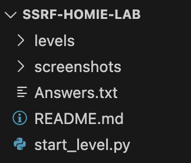


# SSRF lab from scratch

### **DISCLAIMER**


---

### **INTRO**
This lab will help to understand how everything works under the hood when it comes to SSRF vulnerabilities.  
It is important to build hands-on lab from scratch.  
**❗️I will periodically update this repository to add new levels.**

---
### **TOOLS**


---
### **STRUCTURE (Spoilers)**


Backend at `http://127.0.0.1:5050`  
Internal server at `http://127.0.0.1:5051`

---

### **HOW TO USE**

1. In Firefox `about:config` change `network.proxy.allow_hijacking_localhost` from **false** to **true** so that Burp can intercept localhost requests.  
2. Download the lab.  

3. Navigate to the `SSRF-homie-lab/` directory.
4. To start a level, replace `N` with the level number in the command below:
```
bash start_level.sh -N
```

5. Open `http://127.0.0.1:5050/levelN` and try to find SSRF. 

*The levels are not arranged by difficulty. I don't follow a specific progression when creating them; the numbers are only used for ordering.

---

### **CONTACTS**
If you have any suggestions or would like to discuss something, feel free to reach out to me through the contacts in my profile.
